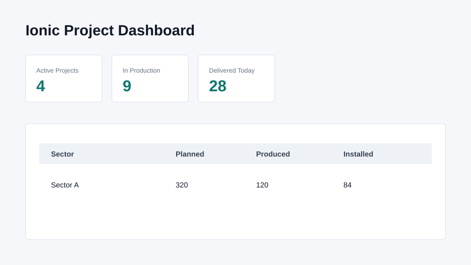

# IONIC Project Reports

Phase 8 adds project reports and an OWL dashboard for Ionic precast manufacturing.

## Features

- Project profitability QWeb PDF.
- Material consumption QWeb PDF.
- Mold utilization QWeb PDF.
- OWL dashboard action with KPIs and sector quantity tracking.

## Screenshots

